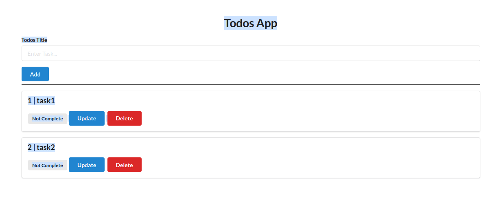
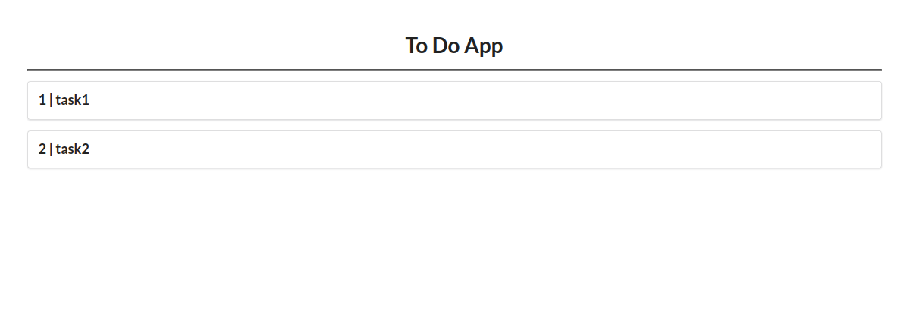

# Name 
DevOps pipeline with Python and Flask

# Description
This is a DevOps pipeline for a simple web app displaying Todos list. The purpose of this project is to demonstrate how to create a DevOps pipeline using GitHub Actions.

*	Web app is developed using python and flask 
* Displays Todos list with update (completed or not completed) and delete options 
*	Cloud deployment 
​
# Dependencies
+ Flask
+ html
+ css
+ python
+ GitHub
+ Docker
+ Kubernetes (minikube and kubectl)

# Install the required software packages to run the web app
pip3 install -r req.txt

# Running the web app
Clone the repository:
	git clone https://github.com/RaghuKA/devops-python.git

Open the page http://127.0.0.1:5000/edit. In this page the tasks can be added or updated or deleted.

  

Open the page http://127.0.0.1:5000/. In this page the added tasks are displayed as a list.

  

# GitHub Actions
The work flow "Docker push" automatically pushes the new releases to the docker container rkumdocker/devopspython.

# Kubernetes container management
Using the following commands the Docker containers can be managed in Kubernetes.

To create pod
* kubectl create -f pod.yaml

To get pods
* kubectl get pods

To create replicas for high availability, load balancing and self healing of application
* kubectl create -f replica.yaml

To rollout to the new release
* kubectl create -f deployment.yaml